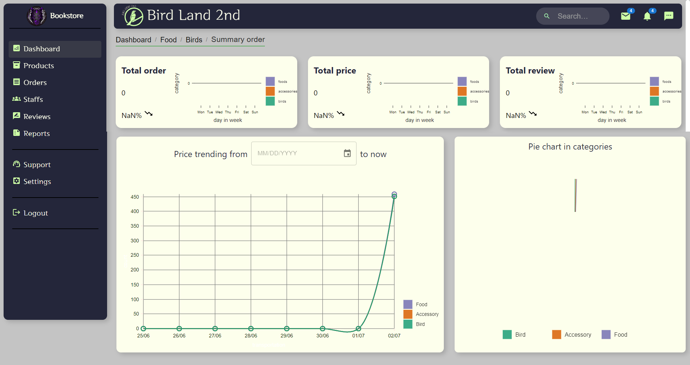
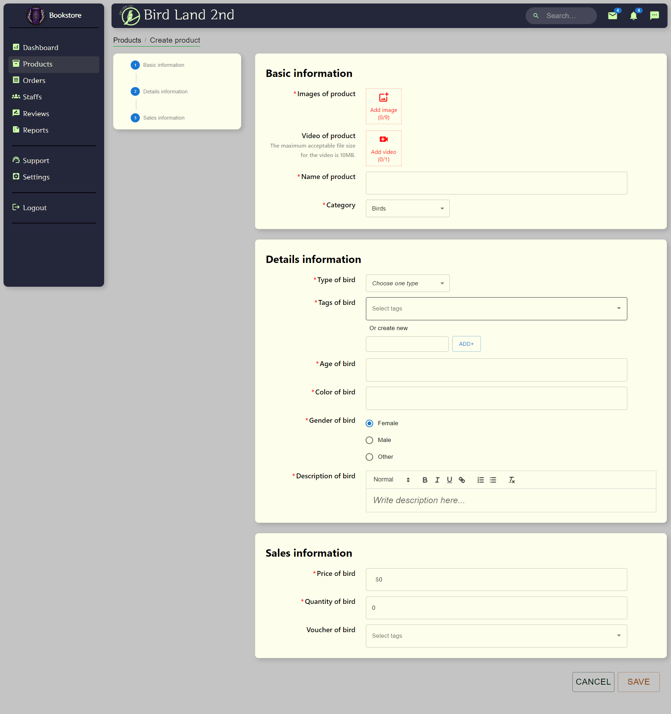
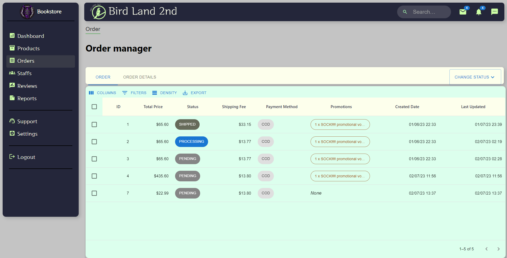
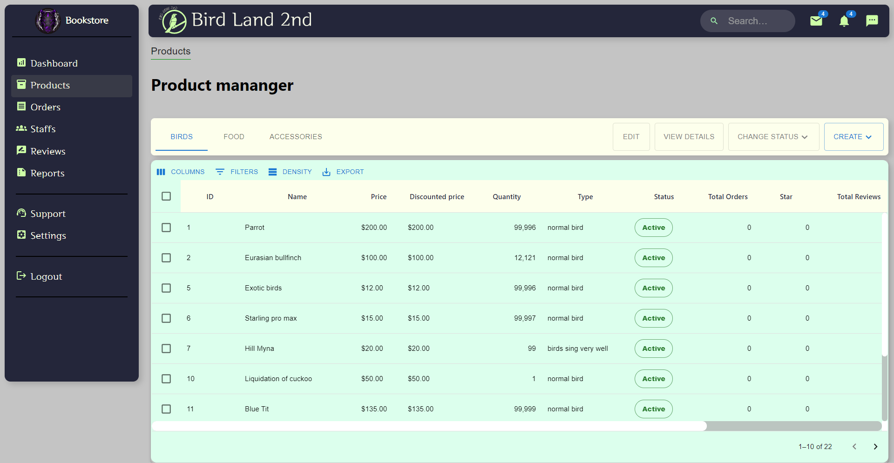
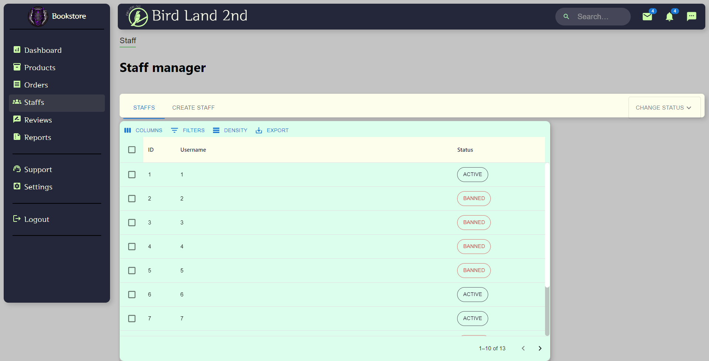
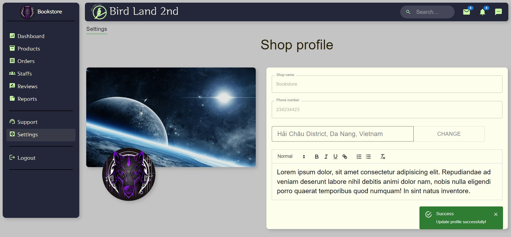

# Bird Trading Platform (Admin Page) - Front End

The admin page serves as the central hub for managing the systems and operations of a shop. It empowers both the shop owner and their staff with efficient controls and tools to streamline their tasks. Built using cutting-edge technologies like JavaScript, ReactJS, Redux Toolkit, Socket.IO, SCSS, and MUI (Material-UI), the admin page offers an intuitive user interface for the manager of the system and the shop owner. The manager of systems can effortlessly oversee various aspects of the entire platform, including managing all accounts in the system, as well as the shops and products associated with them. The shop owner gains insights into sales analytics, financial reports, and customer data, enabling them to make informed business decisions. The staff has the task of chatting with customers and tracking customer orders. With its modern design and powerful functionalities, the admin page revolutionizes the way the shop is managed, enhancing productivity and driving growth.

## Technologies

The project incorporates the following technologies:

- JavaScript: It is a high-level programming language that allows to create dynamic and interactive web pages.
- ReactJS: It is a popular JavaScript library for building user interfaces. ReactJS allows to create reusable UI components and efficiently update the DOM based on changes in application state.

- Redux Toolkit: It is a set of tools that helps simplify the process of managing state in a React application. It provides a predictable and consistent way to manage and update application state, making it easier to build and maintain complex applications.

- Socket.IO: It is a JavaScript library that enables real-time, bidirectional communication between clients and servers. Socket.IO allows to build real-time chat systems.

- SCSS: It is a CSS preprocessor that allows to write CSS in a more organized and efficient way.

- Material UI: It is a popular React component library that provides pre-built UI components based on Google’s Material Design guidelines. Material UI allows to quickly and easily build responsive and attractive user interfaces, while also providing customization options to match a project's unique design needs.

## Link Demo

https://admin.birdland2nd.store/

## Features

- The platform allows users to sign up and sign in using their Google accounts, as well as manage their accounts.
- It provides search and filtering options to help users easily find specific bird listings based on various criteria.
- Users can view product details and reviews, and directly chat with the shop owner for additional information about products.
- Adding products to the cart and updating it is made easy for the user.
- Apart from Cash on Delivery (COD), users can also pay via PayPal.
- The platform allows users to review their orders.
- Shop owners can easily view their shop's sales through statistical calculations presented in chart form.

## Screenshots

# View Revenue Feature

# CRUD Products Feature

# Track Orders Feature

# View Products Feature

# Manage Staff Accounts Feature

# View Setting Feature

## Contribution

This project was created by [1wolfalone1](https://github.com/1wolfalone1) (Cao Nhật Thiên). Contributions to the project are welcome. Feel free to submit bug reports, feature requests, or pull requests to enhance the functionality of the Bird Trading Platform - Front End.
